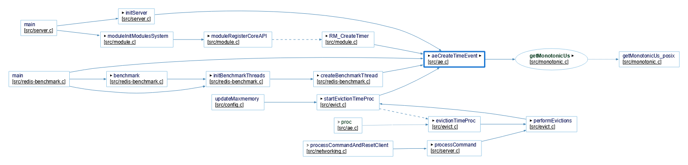
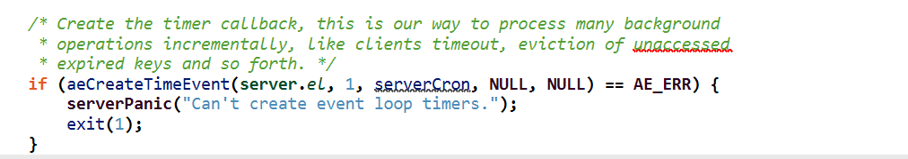
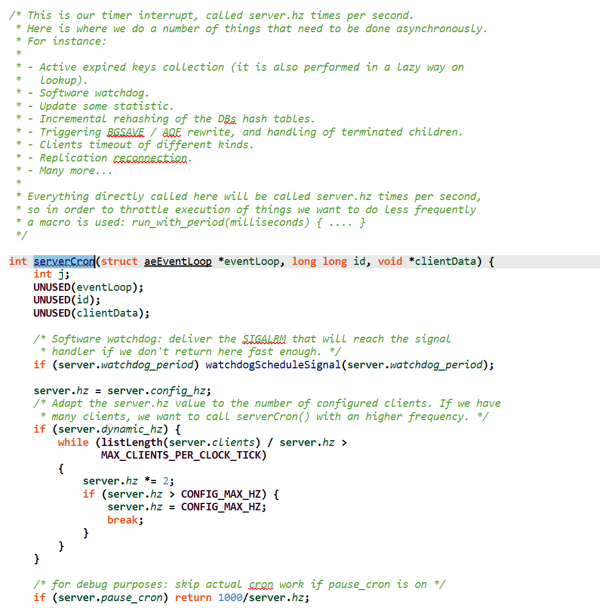
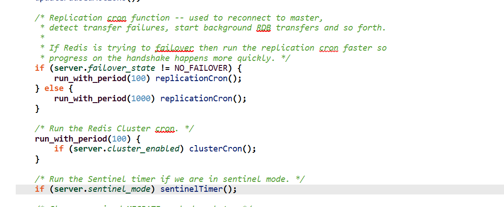
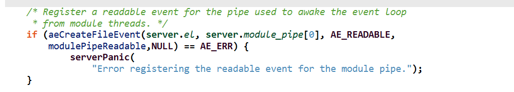

# 初始化服务器

server.c/initServer()


## 注册定时任务




定时器的回调处理函数



其中执行了副本、集群、哨兵相关的定时任务




### 集群定时任务

每100ms执行一次集群定时任务

```c
    /* Run the Redis Cluster cron. */
    run_with_period(100) {
        if (server.cluster_enabled) clusterCron();
    }
```

 clusterCron每秒执行10次，让我们将上述的功能分解并关联到相应的代码片段中：

#### 初始化和设置
1. **初始化及周期性计数**：

   ```c
   /* 每秒执行10次的函数 */
   void clusterCron(void) {
       static unsigned long long iteration = 0; // 统计函数被调用的次数
       mstime_t now = mstime(); // 获取当前时间
   
       iteration++; // 增加迭代计数
   
   ```

   

2. **更新主机名**:
   ```c
   clusterUpdateMyselfHostname();
   ```

3. **握手超时设置**:
   ```c
   handshake_timeout = server.cluster_node_timeout;
   if (handshake_timeout < 1000) handshake_timeout = 1000;
   ```

####  管理节点连接和检查节点健康

```c
/* 获取安全的字典迭代器并遍历集群中的每个节点 */
dictIterator *di = dictGetSafeIterator(server.cluster->nodes);
while ((dictEntry *de = dictNext(di)) != NULL) {
    clusterNode *node = dictGetVal(de);
    
    /* 如果节点连接的发送队列过大，释放连接，并尝试重新连接 */
    clusterNodeCronFreeLinkOnBufferLimitReached(node);

    /* 处理节点的重新连接，如果处理后节点终止，则跳过后续操作 */
    if (clusterNodeCronHandleReconnect(node, server.cluster_node_timeout, now)) continue;
}
dictReleaseIterator(di); // 释放字典迭代器
```


#### 对随机节点发送PING消息

```c
/* 每10次迭代中的一次，发送一个PING消息给随机节点 */
if (!(iteration % 10)) {
    clusterNode *min_pong_node = NULL;
    mstime_t min_pong = 0;

    /* 随机检查5个节点，选择其中最久未收到PONG的节点发送PING */
    for (int j = 0; j < 5; j++) {
        dictEntry *de = dictGetRandomKey(server.cluster->nodes);
        clusterNode *this = dictGetVal(de);

        /* 跳过已断开连接或PING已激活的节点 */
        if (this->link == NULL || this->ping_sent != 0) continue;
        if (this->flags & (CLUSTER_NODE_MYSELF | CLUSTER_NODE_HANDSHAKE)) continue;

        /* 更新最久未收到PONG的节点 */
        if (min_pong_node == NULL || min_pong > this->pong_received) {
            min_pong_node = this;
            min_pong = this->pong_received;
        }
    }
    /* 发送PING消息 */
    if (min_pong_node) {
        serverLog(LL_DEBUG,"Pinging node %.40s", min_pong_node->name);
        clusterSendPing(min_pong_node->link, CLUSTERMSG_TYPE_PING);
    }
}
```


####  检查节点的失败状态

```c
    /* 再次遍历所有节点，检查是否需要标记节点为失败状态，并进行故障转移处理 */
    dictIterator *di = dictGetSafeIterator(server.cluster->nodes);
    while ((dictEntry *de = dictNext(di)) != NULL) {
        clusterNode *node = dictGetVal(de);

        /* 对未响应的节点进行检测和处理 */
        // 此部分包含复杂的逻辑判断和操作，根据节点是否为主节点、从节点，以及节点的PONG接收时间等多个条件进行处理
         now = mstime(); // 获取当前时间

        // 过滤某些特定节点
        if (node->flags & (CLUSTER_NODE_MYSELF|CLUSTER_NODE_NOADDR|CLUSTER_NODE_HANDSHAKE))
            continue;

        // 检查孤立的主节点
        if (nodeIsSlave(myself) && clusterNodeIsMaster(node) && !nodeFailed(node)) {
            int okslaves = clusterCountNonFailingSlaves(node);
            if (okslaves == 0 && node->numslots > 0 && node->flags & CLUSTER_NODE_MIGRATE_TO) {
                orphaned_masters++;
            }
            if (okslaves > max_slaves) max_slaves = okslaves;
            if (myself->slaveof == node) this_slaves = okslaves;
        }

        // 处理连接问题
        // 如果某个节点已经超过1/2的cluster_node_timeout没有联系过，释放掉连接并重连，避免网络问题
        mstime_t ping_delay = now - node->ping_sent;
        mstime_t data_delay = now - node->data_received;
        if (node->link && now - node->link->ctime > server.cluster_node_timeout &&
            node->ping_sent && ping_delay > server.cluster_node_timeout/2 &&
            data_delay > server.cluster_node_timeout/2)
        {
            freeClusterLink(node->link);
        }

        // 发送PING命令
        // 如果最近没有发送ping（收到pong后会重置ping标志），且接收到该节点的最后时间已经超过	1/2node_timeout，则主动发起ping。
        mstime_t ping_interval = server.cluster_ping_interval ? 
            server.cluster_ping_interval : server.cluster_node_timeout/2;
        if (node->link && node->ping_sent == 0 && (now - node->pong_received) > ping_interval) {
            clusterSendPing(node->link, CLUSTERMSG_TYPE_PING);
            continue;
        }

        // 检查节点是否无法到达
        // 如果ping之后，但是最后收包间隔现在仍大于node_timeout，则把该节点置为pfail
        mstime_t node_delay = (ping_delay < data_delay) ? ping_delay : data_delay;
        if (node_delay > server.cluster_node_timeout) {
            if (!(node->flags & (CLUSTER_NODE_PFAIL|CLUSTER_NODE_FAIL))) {
                node->flags |= CLUSTER_NODE_PFAIL;
                update_state = 1;
                // 如果当前节点是主节点并且集群只有一个节点，
                // 那么调用markNodeAsFailingIfNeeded函数可能将该节点标记为失败。
                // 这是集群在极小规模部署时的特殊处理，可能涉及到对单节点故障的快速反应。
                if (clusterNodeIsMaster(myself) && server.cluster->size == 1) {
                    markNodeAsFailingIfNeeded(node);                    
                } else {
                    serverLog(LL_DEBUG,"*** NODE %.40s possibly failing", node->name);
                }
            }
        }
    }
    dictReleaseIterator(di);

```

#### 处理手动和自动故障转移

如果本节点是备份节点，调用故障转移处理函数：clusterHandleSlaveFailover

```c
    /* Abort a manual failover if the timeout is reached. */
    manualFailoverCheckTimeout();

    if (nodeIsSlave(myself)) {
        clusterHandleManualFailover();
        if (!(server.cluster_module_flags & CLUSTER_MODULE_FLAG_NO_FAILOVER))
            clusterHandleSlaveFailover();
        /* If there are orphaned slaves, and we are a slave among the masters
         * with the max number of non-failing slaves, consider migrating to
         * the orphaned masters. Note that it does not make sense to try
         * a migration if there is no master with at least *two* working
         * slaves. */
        if (orphaned_masters && max_slaves >= 2 && this_slaves == max_slaves &&
            server.cluster_allow_replica_migration)
            clusterHandleSlaveMigration(max_slaves);
    }

    if (update_state || server.cluster->state == CLUSTER_FAIL)
        clusterUpdateState();
```


选举超时时间至少是**2秒**，重试间隔至少是**4秒**

```c
void clusterHandleSlaveFailover(void) { 
    ...
	/* Compute the failover timeout (the max time we have to send votes
     * and wait for replies), and the failover retry time (the time to wait
     * before trying to get voted again).
     *
     * Timeout is MAX(NODE_TIMEOUT*2,2000) milliseconds.
     * Retry is two times the Timeout.
     */
    auth_timeout = server.cluster_node_timeout*2;
    if (auth_timeout < 2000) auth_timeout = 2000;
    auth_retry_time = auth_timeout*2;
    ...
       
}
```


计算选举的时间：
**failover_auth_time=mstime() + 500 + random() % 500 + failover_auth_rank * 1000**

```c
     // failover_auth_time=mstime() + 500 + random() % 500 + failover_auth_rank * 1000
     /* If the previous failover attempt timeout and the retry time has
     * elapsed, we can setup a new one. */
    if (auth_age > auth_retry_time) {
        server.cluster->failover_auth_time = mstime() +
            500 + /* Fixed delay of 500 milliseconds, let FAIL msg propagate. */
            random() % 500; /* Random delay between 0 and 500 milliseconds. */
        server.cluster->failover_auth_count = 0;
        server.cluster->failover_auth_sent = 0;
        server.cluster->failover_auth_rank = clusterGetSlaveRank();
        /* We add another delay that is proportional to the slave rank.
         * Specifically 1 second * rank. This way slaves that have a probably
         * less updated replication offset, are penalized. */
        server.cluster->failover_auth_time +=
            server.cluster->failover_auth_rank * 1000;
        /* However if this is a manual failover, no delay is needed. */
        if (server.cluster->mf_end) {
            server.cluster->failover_auth_time = mstime();
            server.cluster->failover_auth_rank = 0;
            clusterDoBeforeSleep(CLUSTER_TODO_HANDLE_FAILOVER);
        }
        serverLog(LL_NOTICE,
            "Start of election delayed for %lld milliseconds "
            "(rank #%d, offset %lld).",
            server.cluster->failover_auth_time - mstime(),
            server.cluster->failover_auth_rank,
            replicationGetSlaveOffset());
        /* Now that we have a scheduled election, broadcast our offset
         * to all the other slaves so that they'll updated their offsets
         * if our offset is better. */
        clusterBroadcastPong(CLUSTER_BROADCAST_LOCAL_SLAVES);
        return;
    }
```

如果不满足条件（时间未到、时间已过）就返回

    /* Return ASAP if we can't still start the election. */
    if (mstime() < server.cluster->failover_auth_time) {
        clusterLogCantFailover(CLUSTER_CANT_FAILOVER_WAITING_DELAY);
        return;
    }
    
    /* Return ASAP if the election is too old to be valid. */
    if (auth_age > auth_timeout) {
        clusterLogCantFailover(CLUSTER_CANT_FAILOVER_EXPIRED);
        return;
    }


发起选举

```c
 /* Ask for votes if needed. */
    if (server.cluster->failover_auth_sent == 0) {
        server.cluster->currentEpoch++;
        server.cluster->failover_auth_epoch = server.cluster->currentEpoch;
        serverLog(LL_NOTICE,"Starting a failover election for epoch %llu.",
            (unsigned long long) server.cluster->currentEpoch);
        clusterRequestFailoverAuth();
        server.cluster->failover_auth_sent = 1;
        clusterDoBeforeSleep(CLUSTER_TODO_SAVE_CONFIG|
                             CLUSTER_TODO_UPDATE_STATE|
                             CLUSTER_TODO_FSYNC_CONFIG);
        return; /* Wait for replies. */
    }
```

检查是否赢得选举

```c
 /* Check if we reached the quorum. */
    if (server.cluster->failover_auth_count >= needed_quorum) {
        /* We have the quorum, we can finally failover the master. */

        serverLog(LL_NOTICE,
            "Failover election won: I'm the new master.");

        /* Update my configEpoch to the epoch of the election. */
        if (myself->configEpoch < server.cluster->failover_auth_epoch) {
            myself->configEpoch = server.cluster->failover_auth_epoch;
            serverLog(LL_NOTICE,
                "configEpoch set to %llu after successful failover",
                (unsigned long long) myself->configEpoch);
        }

        /* Take responsibility for the cluster slots. */
        clusterFailoverReplaceYourMaster();
    } else {
        clusterLogCantFailover(CLUSTER_CANT_FAILOVER_WAITING_VOTES);
    }
```

#### 总结故障转移时间计算

故障发现：node_timeout+period

等待选举：500+(0~500)+period+rank*1000

发起选举：period


## 注册文件可读事件




# 事件驱动

Redis实现了一个简单的事件驱动库ae，位于ae.c

