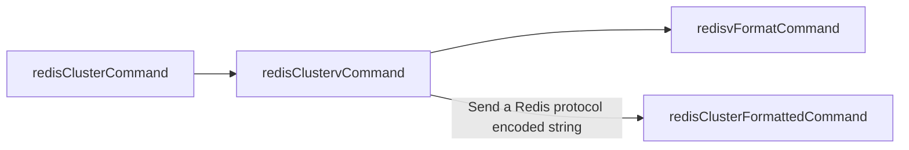

# 一、搭建集群

参考官方文档：https://redis.io/docs/latest/operate/oss_and_stack/management/scaling/

拓扑

```mermaid

```


为所有节点配置目录：

```shell
$ mkdir -p /usr/local/redis_cluster/redis_700{0,1,2}/{conf,pid,logs,data}
```


修改集群配置文件，注意！Redis普通服务会有2套配置文件，一套为普通服务配置文件，一套为集群服务配置文件，我们这里是做的集群，所以修改的集群配置文件，共6份：

例如7001实例配置：

```bash
$ vim /usr/local/redis_cluster/redis_7001/conf/redis.cnf

# 快速修改：:%s/7001/7002/g

# 守护进行模式启动
# 由于与docker -d参数冲突，此处设为no
daemonize no

# 设置数据库数量，默认数据库为0
databases 16

# 绑定地址，需要修改
bind 192.168.74.134

# 绑定端口，需要修改
port 7001

# pid文件存储位置，文件名需要修改
pidfile /etc/redis/pid/redis_7001.pid

# log文件存储位置，文件名需要修改
logfile /etc/redis/logs/redis_7001.log

# RDB快照备份文件名，文件名需要修改
dbfilename redis_7001.rdb

# 本地数据库存储目录，需要修改
dir /etc/redis/data

# 集群相关配置
# 是否以集群模式启动
cluster-enabled yes

# 集群节点回应最长时间，超过该时间被认为下线
cluster-node-timeout 15000

# 生成的集群节点配置文件名，文件名需要修改
cluster-config-file nodes_7001.conf
```


## 启动集群


每个节点上执行以下2条命令进行服务启动：

```shell
docker create --name=redis-cluster-7000 \
-v /usr/local/redis_cluster/redis_7000:/etc/redis/ \
--ipc=host \
--net=host  \
--privileged \
-i redis:latest /usr/local/bin/redis-server /etc/redis/conf/redis.cnf
```


```shell
docker create --name=redis-standalone-6000 \
-v /usr/local/redis_standalone/redis_6000:/etc/redis/ \
--ipc=host \
--net=host  \
--privileged \
-i redis:latest /usr/local/bin/redis-server /etc/redis/conf/redis.cnf
```

```
docker create --name=redis-sentinel-26000 \
-v /usr/local/redis_sentinel/redis_26000:/etc/redis/ \
--ipc=host \
--net=host  \
--privileged \
-i redis:latest /usr/local/bin/redis-server /etc/redis/conf/redis.cnf --sentinel
```


```shell
docker create --name=redis-cluster-7001 \
-v /usr/local/redis_cluster/redis_7001:/etc/redis/ \
--ipc=host \
--net=host  \
--privileged \
-i redis:latest /usr/local/bin/redis-server /etc/redis/conf/redis.cnf
```


```shell
docker create --name=redis-cluster-7002 \
-v /usr/local/redis_cluster/redis_7002:/etc/redis/ \
--ipc=host \
--net=host  \
--privileged \
-i redis:latest /usr/local/bin/redis-server /etc/redis/conf/redis.cnf
```


## 加入集群

加入集群7000

```shell
192.168.74.134:7000> cluster meet 192.168.74.134 7001
192.168.74.134:7000> cluster meet 192.168.74.134 7002
```

查看所有节点

```shell
192.168.74.134:7000> CLUSTER NODES
6f86044a2693c5ec08e1a1128b7fbc9f23299714 192.168.74.134:7001@17001 master - 0 1715045916142 1 connected
fd8c18bf04ac70f8d35ead0c972d05262f249e36 192.168.74.134:7000@17000 myself,master - 0 1715045915000 0 connected
11b3691867873b5938906e5872bdc2d477084935 192.168.74.134:7002@17002 master - 0 1715045915339 2 connected
```

查看集群状态

```shell
192.168.74.134:7000> CLUSTER INFO
cluster_state:fail
cluster_slots_assigned:0
cluster_slots_ok:0
cluster_slots_pfail:0
cluster_slots_fail:0
cluster_known_nodes:3
cluster_size:0
cluster_current_epoch:2
cluster_my_epoch:0
cluster_stats_messages_ping_sent:260
cluster_stats_messages_pong_sent:266
cluster_stats_messages_meet_sent:2
cluster_stats_messages_sent:528
cluster_stats_messages_ping_received:266
cluster_stats_messages_pong_received:262
cluster_stats_messages_received:528
```

## 分配槽位

```shell
╭─root@ciwf1 in /usr/local/redis_cluster/redis_7000
╰$ redis-cli -c -h 192.168.74.134 -p 7000 cluster addslots {0..5461}
OK

╭─root@ciwf1 in /usr/local/redis_cluster/redis_7000
╰$ redis-cli -c -h 192.168.74.134 -p 7001 cluster addslots {5462..10922}
OK

╭─root@ciwf1 in /usr/local/redis_cluster/redis_7000
╰$ redis-cli -c -h 192.168.74.134 -p 7002 cluster addslots {10923..16383}
OK

```

查看状态

```shell
╭─root@ciwf1 in /usr/local/redis_cluster/redis_7000
╰$ redis-cli -c -h 192.168.74.134 -p 7002
192.168.74.134:7002> CLUSTER INFO
cluster_state:ok
cluster_slots_assigned:16384
cluster_slots_ok:16384
cluster_slots_pfail:0
cluster_slots_fail:0
cluster_known_nodes:3
cluster_size:3
cluster_current_epoch:2
cluster_my_epoch:2
cluster_stats_messages_ping_sent:742
cluster_stats_messages_pong_sent:831
cluster_stats_messages_sent:1573
cluster_stats_messages_ping_received:830
cluster_stats_messages_pong_received:742
cluster_stats_messages_meet_received:1
cluster_stats_messages_received:1573
```


## 配置从节点

给7000节点添加两个从节点7004，7005

```shell
mkdir -p /usr/local/redis_cluster/redis_700{4,5}/{conf,pid,logs,data}
```

添加配置

```shell
$ vim /usr/local/redis_cluster/redis_7004/conf/redis.cnf

# 快速修改：:%s/7001/7002/g

# 守护进行模式启动
# 由于与docker -d参数冲突，此处设为no
daemonize no

# 设置数据库数量，默认数据库为0
databases 16

# 绑定地址，需要修改
bind 192.168.74.134

# 绑定端口，需要修改
port 7004

# pid文件存储位置，文件名需要修改
pidfile /etc/redis/pid/redis_7004.pid

# log文件存储位置，文件名需要修改
logfile /etc/redis/logs/redis_7004.log

# RDB快照备份文件名，文件名需要修改
dbfilename redis_7004.rdb

# 本地数据库存储目录，需要修改
dir /etc/redis/data

# 集群相关配置
# 是否以集群模式启动
cluster-enabled yes

# 集群节点回应最长时间，超过该时间被认为下线
cluster-node-timeout 15000

# 生成的集群节点配置文件名，文件名需要修改
cluster-config-file nodes_7004.conf
```

创建容器并启动

```shell
docker create --name=redis-cluster-7004 \
-v /usr/local/redis_cluster/redis_7004:/etc/redis/ \
--ipc=host \
--net=host  \
--privileged \
-i redis:latest /usr/local/bin/redis-server /etc/redis/conf/redis.cnf
```

7005类似。

将7004和7005加入集群

```shell
$ redis-cli -c -h 192.168.74.134 -p 7004
192.168.74.134:7004> CLUSTER nodes
d5be2517126c8d333cf3adcb64ee38cae7916c0a 192.168.74.134:7004@17004 myself,master - 0 1715050370000 3 connected
6f86044a2693c5ec08e1a1128b7fbc9f23299714 192.168.74.134:7001@17001 master - 0 1715050369000 1 connected 5462-10922
fd8c18bf04ac70f8d35ead0c972d05262f249e36 192.168.74.134:7000@17000 master - 0 1715050370000 0 connected 0-5461
11b3691867873b5938906e5872bdc2d477084935 192.168.74.134:7002@17002 master - 0 1715050370026 2 connected 10923-16383
dae56b9986395d1eaf0910df06c12ec473a930ee 192.168.74.134:7005@17005 master - 0 1715050371109 4 connected
192.168.74.134:7004>
```

将7004和7005作为7000的从节点

```shell
192.168.74.134:7004> CLUSTER REPLICATE fd8c18bf04ac70f8d35ead0c972d05262f249e36
OK
```


```shell
$ redis-cli -c -h 192.168.74.134 -p 7005
192.168.74.134:7005> CLUSTER REPLICATE fd8c18bf04ac70f8d35ead0c972d05262f249e36
OK
```

查看集群节点

```shell
192.168.74.134:7005> cluster nodes
11b3691867873b5938906e5872bdc2d477084935 192.168.74.134:7002@17002 master - 0 1715050448599 2 connected 10923-16383
fd8c18bf04ac70f8d35ead0c972d05262f249e36 192.168.74.134:7000@17000 master - 0 1715050449682 0 connected 0-5461
6f86044a2693c5ec08e1a1128b7fbc9f23299714 192.168.74.134:7001@17001 master - 0 1715050449000 1 connected 5462-10922
dae56b9986395d1eaf0910df06c12ec473a930ee 192.168.74.134:7005@17005 myself,slave fd8c18bf04ac70f8d35ead0c972d05262f249e36 0 1715050448000 0 connected
d5be2517126c8d333cf3adcb64ee38cae7916c0a 192.168.74.134:7004@17004 slave fd8c18bf04ac70f8d35ead0c972d05262f249e36 0 1715050447517 0 connected
```

## 故障转移

将7000节点shutdown

```shell
$ redis-cli -c -h 192.168.74.134 -p 7000
192.168.74.134:7000> SHUTDOWN
```

在其他任意节点查看集群状态

```shell
$ redis-cli -c -h 192.168.74.134 -p 7002
192.168.74.134:7002> cluster nodes
6f86044a2693c5ec08e1a1128b7fbc9f23299714 192.168.74.134:7001@17001 master - 0 1715050848000 1 connected 5462-10922
dae56b9986395d1eaf0910df06c12ec473a930ee 192.168.74.134:7005@17005 slave d5be2517126c8d333cf3adcb64ee38cae7916c0a 0 1715050849000 5 connected
fd8c18bf04ac70f8d35ead0c972d05262f249e36 192.168.74.134:7000@17000 master,fail - 1715050822924 1715050819677 0 disconnected
11b3691867873b5938906e5872bdc2d477084935 192.168.74.134:7002@17002 myself,master - 0 1715050847000 2 connected 10923-16383
d5be2517126c8d333cf3adcb64ee38cae7916c0a 192.168.74.134:7004@17004 master - 0 1715050850042 5 connected 0-5461
```

**可以看到7000节点状态为fail，且7004节点已接替为主节点自动分配槽位0-5461**

7004日志：


重新启动7000，看到自动作为了7004的从节点

```shell
192.168.74.134:7002> cluster nodes
6f86044a2693c5ec08e1a1128b7fbc9f23299714 192.168.74.134:7001@17001 master - 0 1715051459000 1 connected 5462-10922
dae56b9986395d1eaf0910df06c12ec473a930ee 192.168.74.134:7005@17005 slave d5be2517126c8d333cf3adcb64ee38cae7916c0a 0 1715051460456 5 connected
fd8c18bf04ac70f8d35ead0c972d05262f249e36 192.168.74.134:7000@17000 slave d5be2517126c8d333cf3adcb64ee38cae7916c0a 0 1715051461536 5 connected
11b3691867873b5938906e5872bdc2d477084935 192.168.74.134:7002@17002 myself,master - 0 1715051460000 2 connected 10923-16383
d5be2517126c8d333cf3adcb64ee38cae7916c0a 192.168.74.134:7004@17004 master - 0 1715051459381 5 connected 0-5461
```

7000节点主动切为主

```shell
╰$ redis-cli -c -h 192.168.74.134 -p 7000
192.168.74.134:7000> CLUSTER FAILOVER
OK
192.168.74.134:7000> cluster nodes
11b3691867873b5938906e5872bdc2d477084935 192.168.74.134:7002@17002 master - 0 1715051633104 2 connected 10923-16383
fd8c18bf04ac70f8d35ead0c972d05262f249e36 192.168.74.134:7000@17000 myself,master - 0 1715051635000 6 connected 0-5461
dae56b9986395d1eaf0910df06c12ec473a930ee 192.168.74.134:7005@17005 slave fd8c18bf04ac70f8d35ead0c972d05262f249e36 0 1715051636350 6 connected
d5be2517126c8d333cf3adcb64ee38cae7916c0a 192.168.74.134:7004@17004 slave fd8c18bf04ac70f8d35ead0c972d05262f249e36 0 1715051635271 6 connected
6f86044a2693c5ec08e1a1128b7fbc9f23299714 192.168.74.134:7001@17001 master - 0 1715051634184 1 connected 5462-10922
```


# 二、设计原理

1.持久化

​	


# 三、代码阅读


## 代码框架


## 数据类型


## 命令执行

流程主线


## 初始化服务器

server.c/initServer()


## 注册定时任务


定时器的回调处理函数


其中执行了副本、集群、哨兵相关的定时任务


### 集群定时任务

每100ms执行一次集群定时任务

```c
    /* Run the Redis Cluster cron. */
    run_with_period(100) {
        if (server.cluster_enabled) clusterCron();
    }
```

 clusterCron每秒执行10次，让我们将上述的功能分解并关联到相应的代码片段中：

#### 初始化和设置
1. **初始化及周期性计数**：

   ```c
   /* 每秒执行10次的函数 */
   void clusterCron(void) {
       static unsigned long long iteration = 0; // 统计函数被调用的次数
       mstime_t now = mstime(); // 获取当前时间
   
       iteration++; // 增加迭代计数
   
   ```

   

2. **更新主机名**:
   ```c
   clusterUpdateMyselfHostname();
   ```

3. **握手超时设置**:
   ```c
   handshake_timeout = server.cluster_node_timeout;
   if (handshake_timeout < 1000) handshake_timeout = 1000;
   ```

####  管理节点连接和检查节点健康

```c
/* 获取安全的字典迭代器并遍历集群中的每个节点 */
dictIterator *di = dictGetSafeIterator(server.cluster->nodes);
while ((dictEntry *de = dictNext(di)) != NULL) {
    clusterNode *node = dictGetVal(de);
    
    /* 如果节点连接的发送队列过大，释放连接，并尝试重新连接 */
    clusterNodeCronFreeLinkOnBufferLimitReached(node);

    /* 处理节点的重新连接，如果处理后节点终止，则跳过后续操作 */
    if (clusterNodeCronHandleReconnect(node, server.cluster_node_timeout, now)) continue;
}
dictReleaseIterator(di); // 释放字典迭代器
```


#### 对随机节点发送PING消息

```c
/* 每10次迭代中的一次，发送一个PING消息给随机节点 */
if (!(iteration % 10)) {
    clusterNode *min_pong_node = NULL;
    mstime_t min_pong = 0;

    /* 随机检查5个节点，选择其中最久未收到PONG的节点发送PING */
    for (int j = 0; j < 5; j++) {
        dictEntry *de = dictGetRandomKey(server.cluster->nodes);
        clusterNode *this = dictGetVal(de);

        /* 跳过已断开连接或PING已激活的节点 */
        if (this->link == NULL || this->ping_sent != 0) continue;
        if (this->flags & (CLUSTER_NODE_MYSELF | CLUSTER_NODE_HANDSHAKE)) continue;

        /* 更新最久未收到PONG的节点 */
        if (min_pong_node == NULL || min_pong > this->pong_received) {
            min_pong_node = this;
            min_pong = this->pong_received;
        }
    }
    /* 发送PING消息 */
    if (min_pong_node) {
        serverLog(LL_DEBUG,"Pinging node %.40s", min_pong_node->name);
        clusterSendPing(min_pong_node->link, CLUSTERMSG_TYPE_PING);
    }
}
```


####  检查节点的失败状态

```c
    /* 再次遍历所有节点，检查是否需要标记节点为失败状态，并进行故障转移处理 */
    dictIterator *di = dictGetSafeIterator(server.cluster->nodes);
    while ((dictEntry *de = dictNext(di)) != NULL) {
        clusterNode *node = dictGetVal(de);

        /* 对未响应的节点进行检测和处理 */
        // 此部分包含复杂的逻辑判断和操作，根据节点是否为主节点、从节点，以及节点的PONG接收时间等多个条件进行处理
         now = mstime(); // 获取当前时间

        // 过滤某些特定节点
        if (node->flags & (CLUSTER_NODE_MYSELF|CLUSTER_NODE_NOADDR|CLUSTER_NODE_HANDSHAKE))
            continue;

        // 检查孤立的主节点
        if (nodeIsSlave(myself) && clusterNodeIsMaster(node) && !nodeFailed(node)) {
            int okslaves = clusterCountNonFailingSlaves(node);
            if (okslaves == 0 && node->numslots > 0 && node->flags & CLUSTER_NODE_MIGRATE_TO) {
                orphaned_masters++;
            }
            if (okslaves > max_slaves) max_slaves = okslaves;
            if (myself->slaveof == node) this_slaves = okslaves;
        }

        // 处理连接问题
        // 如果某个节点已经超过1/2的cluster_node_timeout没有联系过，释放掉连接并重连，避免网络问题
        mstime_t ping_delay = now - node->ping_sent;
        mstime_t data_delay = now - node->data_received;
        if (node->link && now - node->link->ctime > server.cluster_node_timeout &&
            node->ping_sent && ping_delay > server.cluster_node_timeout/2 &&
            data_delay > server.cluster_node_timeout/2)
        {
            freeClusterLink(node->link);
        }

        // 发送PING命令
        // 如果最近没有发送ping（收到pong后会重置ping标志），且接收到该节点的最后时间已经超过	1/2node_timeout，则主动发起ping。
        mstime_t ping_interval = server.cluster_ping_interval ? 
            server.cluster_ping_interval : server.cluster_node_timeout/2;
        if (node->link && node->ping_sent == 0 && (now - node->pong_received) > ping_interval) {
            clusterSendPing(node->link, CLUSTERMSG_TYPE_PING);
            continue;
        }

        // 检查节点是否无法到达
        // 如果ping之后，但是最后收包间隔现在仍大于node_timeout，则把该节点置为pfail
        mstime_t node_delay = (ping_delay < data_delay) ? ping_delay : data_delay;
        if (node_delay > server.cluster_node_timeout) {
            if (!(node->flags & (CLUSTER_NODE_PFAIL|CLUSTER_NODE_FAIL))) {
                node->flags |= CLUSTER_NODE_PFAIL;
                update_state = 1;
                // 如果当前节点是主节点并且集群只有一个节点，
                // 那么调用markNodeAsFailingIfNeeded函数可能将该节点标记为失败。
                // 这是集群在极小规模部署时的特殊处理，可能涉及到对单节点故障的快速反应。
                if (clusterNodeIsMaster(myself) && server.cluster->size == 1) {
                    markNodeAsFailingIfNeeded(node);                    
                } else {
                    serverLog(LL_DEBUG,"*** NODE %.40s possibly failing", node->name);
                }
            }
        }
    }
    dictReleaseIterator(di);

```

#### 处理手动和自动故障转移

如果本节点是备份节点，调用故障转移处理函数：clusterHandleSlaveFailover

```c
    /* Abort a manual failover if the timeout is reached. */
    manualFailoverCheckTimeout();

    if (nodeIsSlave(myself)) {
        clusterHandleManualFailover();
        if (!(server.cluster_module_flags & CLUSTER_MODULE_FLAG_NO_FAILOVER))
            clusterHandleSlaveFailover();
        /* If there are orphaned slaves, and we are a slave among the masters
         * with the max number of non-failing slaves, consider migrating to
         * the orphaned masters. Note that it does not make sense to try
         * a migration if there is no master with at least *two* working
         * slaves. */
        if (orphaned_masters && max_slaves >= 2 && this_slaves == max_slaves &&
            server.cluster_allow_replica_migration)
            clusterHandleSlaveMigration(max_slaves);
    }

    if (update_state || server.cluster->state == CLUSTER_FAIL)
        clusterUpdateState();
```


选举超时时间至少是**2秒**，重试间隔至少是**4秒**

```c
void clusterHandleSlaveFailover(void) { 
    ...
	/* Compute the failover timeout (the max time we have to send votes
     * and wait for replies), and the failover retry time (the time to wait
     * before trying to get voted again).
     *
     * Timeout is MAX(NODE_TIMEOUT*2,2000) milliseconds.
     * Retry is two times the Timeout.
     */
    auth_timeout = server.cluster_node_timeout*2;
    if (auth_timeout < 2000) auth_timeout = 2000;
    auth_retry_time = auth_timeout*2;
    ...
       
}
```


计算选举的时间：
**failover_auth_time=mstime() + 500 + random() % 500 + failover_auth_rank * 1000**

```c
     // failover_auth_time=mstime() + 500 + random() % 500 + failover_auth_rank * 1000
     /* If the previous failover attempt timeout and the retry time has
     * elapsed, we can setup a new one. */
    if (auth_age > auth_retry_time) {
        server.cluster->failover_auth_time = mstime() +
            500 + /* Fixed delay of 500 milliseconds, let FAIL msg propagate. */
            random() % 500; /* Random delay between 0 and 500 milliseconds. */
        server.cluster->failover_auth_count = 0;
        server.cluster->failover_auth_sent = 0;
        server.cluster->failover_auth_rank = clusterGetSlaveRank();
        /* We add another delay that is proportional to the slave rank.
         * Specifically 1 second * rank. This way slaves that have a probably
         * less updated replication offset, are penalized. */
        server.cluster->failover_auth_time +=
            server.cluster->failover_auth_rank * 1000;
        /* However if this is a manual failover, no delay is needed. */
        if (server.cluster->mf_end) {
            server.cluster->failover_auth_time = mstime();
            server.cluster->failover_auth_rank = 0;
            clusterDoBeforeSleep(CLUSTER_TODO_HANDLE_FAILOVER);
        }
        serverLog(LL_NOTICE,
            "Start of election delayed for %lld milliseconds "
            "(rank #%d, offset %lld).",
            server.cluster->failover_auth_time - mstime(),
            server.cluster->failover_auth_rank,
            replicationGetSlaveOffset());
        /* Now that we have a scheduled election, broadcast our offset
         * to all the other slaves so that they'll updated their offsets
         * if our offset is better. */
        clusterBroadcastPong(CLUSTER_BROADCAST_LOCAL_SLAVES);
        return;
    }
```

如果不满足条件（时间未到、时间已过）就返回

    /* Return ASAP if we can't still start the election. */
    if (mstime() < server.cluster->failover_auth_time) {
        clusterLogCantFailover(CLUSTER_CANT_FAILOVER_WAITING_DELAY);
        return;
    }
    
    /* Return ASAP if the election is too old to be valid. */
    if (auth_age > auth_timeout) {
        clusterLogCantFailover(CLUSTER_CANT_FAILOVER_EXPIRED);
        return;
    }


发起选举

```c
 /* Ask for votes if needed. */
    if (server.cluster->failover_auth_sent == 0) {
        server.cluster->currentEpoch++;
        server.cluster->failover_auth_epoch = server.cluster->currentEpoch;
        serverLog(LL_NOTICE,"Starting a failover election for epoch %llu.",
            (unsigned long long) server.cluster->currentEpoch);
        clusterRequestFailoverAuth();
        server.cluster->failover_auth_sent = 1;
        clusterDoBeforeSleep(CLUSTER_TODO_SAVE_CONFIG|
                             CLUSTER_TODO_UPDATE_STATE|
                             CLUSTER_TODO_FSYNC_CONFIG);
        return; /* Wait for replies. */
    }
```

检查是否赢得选举

```c
 /* Check if we reached the quorum. */
    if (server.cluster->failover_auth_count >= needed_quorum) {
        /* We have the quorum, we can finally failover the master. */

        serverLog(LL_NOTICE,
            "Failover election won: I'm the new master.");

        /* Update my configEpoch to the epoch of the election. */
        if (myself->configEpoch < server.cluster->failover_auth_epoch) {
            myself->configEpoch = server.cluster->failover_auth_epoch;
            serverLog(LL_NOTICE,
                "configEpoch set to %llu after successful failover",
                (unsigned long long) myself->configEpoch);
        }

        /* Take responsibility for the cluster slots. */
        clusterFailoverReplaceYourMaster();
    } else {
        clusterLogCantFailover(CLUSTER_CANT_FAILOVER_WAITING_VOTES);
    }
```

#### 总结故障转移时间计算

故障发现：node_timeout+period

等待选举：500+(0~500)+period+rank*1000

发起选举：period


## 注册文件可读事件


## 事件驱动

Redis实现了一个的事件驱动库ae，位于ae.c


## 哨兵

### 处理HELLO消息

HELLO 消息用于哨兵之间相互发现和通信，以共享有关主节点和其他哨兵的信息。以下是对这段代码的详细分析：

#### 函数定义

```c
void sentinelProcessHelloMessage(char *hello, int hello_len) {
```

函数 `sentinelProcessHelloMessage` 处理接收到的 HELLO 消息。参数 `hello` 是消息的内容，`hello_len` 是消息的长度。

#### 解析消息

```c
	/* Format is composed of 8 tokens:
     * 0=ip,1=port,2=runid,3=current_epoch,4=master_name,
     * 5=master_ip,6=master_port,7=master_config_epoch. */
    int numtokens, port, removed, master_port;
    uint64_t current_epoch, master_config_epoch;
    char **token = sdssplitlen(hello, hello_len, ",", 1, &numtokens);
    sentinelRedisInstance *si, *master;
```

消息由 8 个字段组成，分别表示哨兵的 IP、端口、运行 ID、当前纪元、主节点名称、主节点 IP、主节点端口和主节点配置纪元。使用 `sdssplitlen` 函数将消息按逗号分割成多个令牌（tokens）。

#### 验证消息格式

```c
    if (numtokens == 8) {
```

确保消息包含正确数量的字段。如果字段数量不正确，直接跳过消息处理。

#### 获取主节点引用

```c
		master = sentinelGetMasterByName(token[4]);
        if (!master) goto cleanup; /* Unknown master, skip the message. */
```

根据主节点名称获取对应的主节点实例。如果找不到对应的主节点，则跳过该消息。

#### 检查现有的哨兵实例

```c
		port = atoi(token[1]);
        master_port = atoi(token[6]);
        si = getSentinelRedisInstanceByAddrAndRunID(master->sentinels, token[0], port, token[2]);
        current_epoch = strtoull(token[3], NULL, 10);
        master_config_epoch = strtoull(token[7], NULL, 10);
```

解析消息中的端口、主节点端口、当前纪元和主节点配置纪元，并尝试**根据地址和运行 ID 获取现有的哨兵实例**。

#### 处理新的哨兵实例

```c
        if (!si) {
            // 尝试移除所有具有相同运行 ID 的哨兵（可能是因为地址更改）
            removed = removeMatchingSentinelFromMaster(master, token[2]);
            if (removed) {
                sentinelEvent(LL_NOTICE,"+sentinel-address-switch",master,"%@ ip %s port %d for %s", token[0], port, token[2]);
            } else {
                // 如果没有匹配的哨兵，检查是否存在具有相同地址的其他哨兵，并将其标记为无效地址
                sentinelRedisInstance *other = getSentinelRedisInstanceByAddrAndRunID(master->sentinels, token[0], port, NULL);
                if (other) {
                    sentinelEvent(LL_NOTICE,"+sentinel-invalid-addr",other,"%@");
                    dictIterator *di;
                    dictEntry *de;

                    sds runid_obsolete = sdsnew(other->runid);

                    di = dictGetIterator(sentinel.masters);
                    while((de = dictNext(di)) != NULL) {
                        sentinelRedisInstance *master = dictGetVal(de);
                        removeMatchingSentinelFromMaster(master, runid_obsolete);
                    }
                    dictReleaseIterator(di);
                    sdsfree(runid_obsolete);
                }
            }

           	// 然后创建一个新的哨兵实例
            si = createSentinelRedisInstance(token[2], SRI_SENTINEL, token[0], port, master->quorum, master);

            if (si) {
                if (!removed) sentinelEvent(LL_NOTICE,"+sentinel",si,"%@");
                si->runid = sdsnew(token[2]);
                sentinelTryConnectionSharing(si);
                if (removed) sentinelUpdateSentinelAddressInAllMasters(si);
                sentinelFlushConfig();
            }
        }
```

如果现有哨兵实例不存在，尝试移除所有具有相同运行 ID 的哨兵（可能是因为地址更改）。如果没有匹配的哨兵，检查是否存在具有相同地址的其他哨兵，并将其标记为无效地址。然后创建一个新的哨兵实例并进行必要的初始化和配置更新。

#### 更新本地纪元和主节点配置

```c
        if (current_epoch > sentinel.current_epoch) {
            sentinel.current_epoch = current_epoch;
            sentinelFlushConfig();
            sentinelEvent(LL_WARNING,"+new-epoch",master,"%llu", (unsigned long long) sentinel.current_epoch);
        }

        if (si && master->config_epoch < master_config_epoch) {
            master->config_epoch = master_config_epoch;
            if (master_port != master->addr->port || !sentinelAddrEqualsHostname(master->addr, token[5])) {
                sentinelAddr *old_addr;

                sentinelEvent(LL_WARNING,"+config-update-from",si,"%@");
                sentinelEvent(LL_WARNING,"+switch-master", master,"%s %s %d %s %d", master->name, announceSentinelAddr(master->addr), master->addr->port, token[5], master_port);

                old_addr = dupSentinelAddr(master->addr);
                sentinelResetMasterAndChangeAddress(master, token[5], master_port);
                sentinelCallClientReconfScript(master, SENTINEL_OBSERVER,"start", old_addr, master->addr);
                releaseSentinelAddr(old_addr);
            }
        }
```

如果接收到的纪元比当前纪元大，则更新本地纪元。如果接收到的主节点配置纪元比当前的大，并且主节点地址或端口发生变化，则更新主节点的信息并触发相关事件和脚本。

#### 更新哨兵状态

```c
        if (si) si->last_hello_time = mstime();
    }

cleanup:
    sdsfreesplitres(token, numtokens);
}
```

更新哨兵的最后 HELLO 时间，并释放消息令牌的内存。


# 四、hiredis-cluster

## 命令定义

命令定义在cmddef.h文件中。

- 更新命令

```shell
 ./gencommands.py path/to/redis/src/commands/*.json > cmddef.h
```

- 手动添加


## 同步API

| 集群同步APIs                   | 说明                                          |
| ------------------------------ | --------------------------------------------- |
| redisClusterContextInit        | 创建redisClusterContext，主要用于存储连接状态 |
| redisClusterSetOptionAddNodes  | 用于添加Redis集群地址                         |
| redisClusterSetOptionUsername  | 用于配置认证                                  |
| redisClusterSetOptionPassword  | 同上                                          |
| redisClusterConnect2           | 用于连接Redis集群                             |
| redisClusterSetEventCallback   | 注册事件回调                                  |
| redisClusterSetConnectCallback | 注册连接回调，用于获取连接及重连通知          |
| redisClusterCommand            | 发送命令，采用类似于printf的格式              |

### **连接示例**

```c
redisClusterContext *cc = redisClusterContextInit();
redisClusterSetOptionAddNodes(cc, "127.0.0.1:6379,127.0.0.1:6380");
redisClusterConnect2(cc);
if (cc != NULL && cc->err) {
    printf("Error: %s\n", cc->errstr);
    // handle error
}
```


### **注册事件回调**

```c
int redisClusterSetEventCallback(redisClusterContext *cc,
                                 void(fn)(const redisClusterContext *cc, int event,
                                          void *privdata),
                                 void *privdata);
```

其中event包括

- `HIRCLUSTER_EVENT_SLOTMAP_UPDATED`：当槽映射（slot mapping）更新时；
- `HIRCLUSTER_EVENT_READY`：当槽映射首次拉取完成，并且客户端准备好接收命令时。主要用于通过`redisClusterAsyncConnect2()`异步初始化client
- `HIRCLUSTER_EVENT_FREE_CONTEXT`：当context被释放时


### **注册连接回调**

```c
int redisClusterSetConnectCallback(redisClusterContext *cc,
                                   void(fn)(const redisContext *c, int status));
```

在连接建立，TLS握手以及Redis正常完成前被调用。

连接成功后， `status` 设置为 `REDIS_OK` 并且 redisContext（在 hiredis.h 中定义）可用于查看它连接到的 IP 和端口，或者直接在文件描述符上设置套接字选项，通过 `c->fd` 。

在连接尝试失败时，将调用此回调，并将 `status` 设置为 `REDIS_ERR` 。中的 `err` `redisContext` 字段可用于找出错误的原因。


### **发送命令**

```c
reply = redisClusterCommand(clustercontext, "SET key:%s %s", myid, value);
```

客户端将根据Key将命令发送到特定的集群节点。如果Redis节点返回**重定向错误**，客户端将处理该错误，并更新槽位，然后重新发送命令至正确的节点。


### **发送多Key命令**

```c
reply = redisClusterCommand(clustercontext, "mget %s %s %s %s", key1, key2, key3, key4);
```

Hiredis-cluster 支持 mget/mset/del 多键命令。该命令将按插槽拆分并发送到正确的 Redis 节点。


### **向特定节点发送命令**

```c
reply = redisClusterCommandToNode(clustercontext, node, "DBSIZE");
```

此函数处理类似于 `redisClusterCommand()` 的 printf 参数，但只会尝试将命令发送到给定节点，而不会执行重定向或重试。

如果命令超时或与节点的连接失败，则计划在发送下一个命令时执行 slotmap 更新。 如果之前已计划过 slotmap 更新， `redisClusterCommandToNode` 则还会执行 slotmap 更新。


### **断开连接**

```c
void redisClusterFree(redisClusterContext *cc);
```

此函数关闭套接字并释放上下文。


## **命令pipeline**

```c
int redisClusterAppendCommand(redisClusterContext *cc, const char *format, ...);
int redisClusterAppendCommandArgv(redisClusterContext *cc, int argc, const char **argv);

/* Send a command to a specific cluster node */
int redisClusterAppendCommandToNode(redisClusterContext *cc, redisClusterNode *node,
                                    const char *format, ...);
```

除了没有回复信息返回外，与`redisClusterCommand`系列函数用法相同。

在调用任一函数一次或多次后，可通过 `redisClusterGetReply` 接收后续的回复。此函数的返回值为 `REDIS_OK` 或 `REDIS_ERR` ，其中后者表示读取回复时发生错误。与其他命令一样，上下文中的 `err` 字段可用于找出此错误的原因。

**特别注意**

```c
void redisClusterReset(redisClusterContext *cc);
```

- 必须在一次流水线之后调用 `redisClusterReset` 函数
- 在未执行流水线的情况下进行调用 `redisClusterReset` 将重置所有 Redis 连接

**集群pipeline示例**

```c
redisReply *reply;
redisClusterAppendCommand(clusterContext,"SET foo bar");
redisClusterAppendCommand(clusterContext,"GET foo");
redisClusterGetReply(clusterContext,&reply); // reply for SET
freeReplyObject(reply);
redisClusterGetReply(clusterContext,&reply); // reply for GET
freeReplyObject(reply);
redisClusterReset(clusterContext);
```


## **异步API**

Hiredis-cluster 附带了一个异步集群 API，适用于许多事件系统。目前，有一些适配器支持 `libevent` 、 `libev` 、 `libuv` 和 `glib` Redis 事件库 （ `ae` ）。有关用法示例，请参阅具有不同事件库的测试程序 `tests/ct_async_{libev,libuv,glib}.c`


### 建立连接

有两种初始化集群客户端的方式。

**1. 通过`redisClusterAsyncConnect`**

该函数以阻塞的方式连接到集群，返回前等待slotmap。此后用户发送的任何命令都将创建新的非阻塞连接，除非目标的非阻塞连接已存在。该函数返回指向新创建 `redisClusterAsyncContext` 结构的指针，应检查其 `err` 字段以确保初始 slotmap 更新成功。

```c
// Insufficient error handling for brevity.
redisClusterAsyncContext *acc = redisClusterAsyncConnect("127.0.0.1:6379", HIRCLUSTER_FLAG_NULL);
if (acc->err) {
    printf("error: %s\n", acc->errstr);
    exit(1);
}

// Attach an event engine. In this example we use libevent.
struct event_base *base = event_base_new();
redisClusterLibeventAttach(acc, base);
```

**2. 通过`redisClusterAsyncContextInit`和`redisClusterAsyncConnect2`**

避免初始时的阻塞连接。在调用`redisClusterAsyncConnect2`需要附加事件引擎，但连接和初始 slotmap 更新是以非阻塞方式完成的。

这意味着之后 `redisClusterAsyncConnect2` 直接发送的命令可能会失败，因为尚未检索初始 slotmap，并且客户端不知道要将命令发送到哪个群集节点。可以使用 eventCallback 在 slotmap 更新且客户端准备好接受命令时收到通知。

```c
// Insufficient error handling for brevity.
redisClusterAsyncContext *acc = redisClusterAsyncContextInit();

// Add a cluster node address for the initial connect.
redisClusterSetOptionAddNodes(acc->cc, "127.0.0.1:6379");

// Attach an event engine. In this example we use libevent.
struct event_base *base = event_base_new();
redisClusterLibeventAttach(acc, base);

if (redisClusterAsyncConnect2(acc) != REDIS_OK) {
    printf("error: %s\n", acc->errstr);
    exit(1);
}
```

### 连接回调

由于将创建的连接是非阻塞的，因此如果指定的主机和端口能够接受连接，则内核无法立即返回。相反，请使用连接回调在连接建立或失败时收到通知。同样，断开连接回调可用于通知断开连接（由于错误或每个用户请求）。

```c
int redisClusterAsyncSetConnectCallback(redisClusterAsyncContext *acc,
                                        redisConnectCallback *fn);
int redisClusterAsyncSetDisonnectCallback(redisClusterAsyncContext *acc,
                                          redisConnectCallback *fn);
```

回调函数`redisConnectCallback`原型如下

```c
void(const redisAsyncContext *ac, int status);
```


对于hiredis>=v1.10的情况，使用以下方法注册事件：

```c
int redisClusterAsyncSetConnectCallbackNC(redisClusterAsyncContext *acc,
                                          redisConnectCallbackNC *fn);
```

回调函数`redisConnectCallbackNC`原型为

```c
void(redisAsyncContext *ac, int status);
```

ac是一个非常量的`redisAsyncContext *`。


- 当连接成功时，`status`参数被置为`REDIS_OK`，socket文件描述符可通过`ac->c->fd`获取；
- 当用户主动断开连接时， `status` 参数设置为 `REDIS_OK` ；
- 当因错误导致连接断开时， `status` 参数设置为 `REDIS_ERR ` ，可以访问上下文中的 `err` 字段以找出错误的原因。

无需在断开连接回调中重新连接。**Hiredis-cluster 将在处理此 Redis 节点的下一个命令时自行重新连接**。

每个context只能设置连接和断开连接回调一次。对于后续调用，它将返回 `REDIS_ERR` 。


### 命令回调

在异步群集上下文中，由于事件循环的性质，命令会自动流水线化。因此，与同步 API 不同，只有一种发送命令的方式。由于命令是异步发送到 Redis 集群的，因此发出命令需要在收到回复时调用回调函数。回复回调函数应具有以下原型

```c
void(redisClusterAsyncContext *acc, void *reply, void *privdata);
```


异步上下文中常用的命令发送函数：

```c
int redisClusterAsyncCommand(redisClusterAsyncContext *acc,
                             redisClusterCallbackFn *fn,
                             void *privdata, const char *format, ...);
int redisClusterAsyncCommandArgv(redisClusterAsyncContext *acc,
                                 redisClusterCallbackFn *fn, void *privdata,
                                 int argc, const char **argv,
                                 const size_t *argvlen);
int redisClusterAsyncFormattedCommand(redisClusterAsyncContext *acc,
                                      redisClusterCallbackFn *fn,
                                      void *privdata, char *cmd, int len);
```

命令成功添加到输出缓冲区的时,返回值是 `REDIS_OK` ，否则`REDIS_ERR` 。

当每个用户请求断开连接时，不会向输出缓冲区添加新命令并返回`REDIS_ERR`。

当命令的回调为NULL时，命令回复会立即释放。当回调为non-NULL时，内存会在回调完成后释放。

### 向特定节点发送命令

```c
int redisClusterAsyncCommandToNode(redisClusterAsyncContext *acc,
                                   redisClusterNode *node,
                                   redisClusterCallbackFn *fn, void *privdata,
                                   const char *format, ...);
int redisClusterAsyncCommandArgvToNode(redisClusterAsyncContext *acc,
                                       redisClusterNode *node,
                                       redisClusterCallbackFn *fn,
                                       void *privdata, int argc,
                                       const char **argv,
                                       const size_t *argvlen);
int redisClusterAsyncFormattedCommandToNode(redisClusterAsyncContext *acc,
                                            redisClusterNode *node,
                                            redisClusterCallbackFn *fn,
                                            void *privdata, char *cmd, int len);
```

这些函数只会尝试将命令发送到特定节点，不会执行重定向或重试，但通信错误将触发 slotmap 更新，就像常用的 API 一样。

### 断开连接

```c
void redisClusterAsyncDisconnect(redisClusterAsyncContext *acc);
```

调用此函数时，连接不会立即终止。相反，不再接受新命令，并且只有在将所有挂起的命令写入套接字、读取其各自的应答并执行其各自的回调时，才会终止连接。在此之后，将以 status 执行 `REDIS_OK` 断开连接回调，并释放上下文对象。


## 集群节点迭代器

`redisClusterNodeIterator` 可用于在集群上下文中的所有已知主节点上进行迭代。需要使用 `redisClusterInitNodeIterator()` 启动它，然后您可以重复调用 `redisClusterNodeNext()` 以从迭代器获取下一个节点。

```c
void redisClusterInitNodeIterator(redisClusterNodeIterator *iter,
                                  redisClusterContext *cc);
redisClusterNode *redisClusterNodeNext(redisClusterNodeIterator *iter);
```

迭代器将通过重新启动迭代来处理由于 slotmap 更新而引起的更改，但仅在新的主节点集上。

触发重新启动时，不会对已迭代的节点进行簿记，这意味着节点可以迭代多次，具体取决于 slotmap 更新发生的时间和集群节点的更改。

### 检测slotmap更新

要检测 slotmap 何时更新，您可以检查迭代器的 slotmap 版本 （ `iter.route_version` ） 是否等于当前集群上下文的 slotmap 版本 （ `cc->route_version` ）。如果不是，则表示 slotmap 已更新，迭代器将在下次调用 `redisClusterNodeNext` 时重新启动。

检测 slotmap 是否已更新的另一种方法是注册事件回调并查找事件 `HIRCLUSTER_EVENT_SLOTMAP_UPDATED` 。


## 随机数生成器

在选择节点 用于请求集群拓扑（slotmap） 时使用会使用[random()](https://linux.die.net/man/3/random) 方法。

用户应该使用 srandom（） 为随机数生成器设定种子，以降低节点选择的可预测性。


## 内存分配器

Hiredis-cluster 使用 hiredis 分配结构，具有可配置的分配和解除分配功能。默认情况下，它们只指向 libc （ `malloc` ， `calloc` ， `realloc` ， etc）。

通过以下方式自定义内存分配器

```c
hiredisAllocFuncs myfuncs = {
    .mallocFn = my_malloc,
    .callocFn = my_calloc,
    .reallocFn = my_realloc,
    .strdupFn = my_strdup,
    .freeFn = my_free,
};

// Override allocators (function returns current allocators if needed)
hiredisAllocFuncs orig = hiredisSetAllocators(&myfuncs);
```

要将分配器重置为默认的 libc 函数，只需调用：

```c
hiredisResetAllocators();
```


## 代码阅读

### 关键数据结构

#### redisClusterContext

```c
/* Context for accessing a Redis Cluster */
typedef struct redisClusterContext {
    int err;          /* Error flags, 0 when there is no error */
    char errstr[128]; /* String representation of error when applicable */

    /* Configurations */
    int flags;                       /* Configuration flags */
    struct timeval *connect_timeout; /* TCP connect timeout */
    struct timeval *command_timeout; /* Receive and send timeout */
    int max_retry_count;             /* Allowed retry attempts */
    char *username;                  /* Authenticate using user */
    char *password;                  /* Authentication password */

    struct dict *nodes;       /* Known redisClusterNode's */
    uint64_t route_version;   /* Increased when the node lookup table changes */
    redisClusterNode **table; /* redisClusterNode lookup table */

    struct hilist *requests; /* Outstanding commands (Pipelining) */

    int retry_count;       /* Current number of failing attempts */
    int need_update_route; /* Indicator for redisClusterReset() (Pipel.) */

    void *ssl; /* Pointer to a redisSSLContext when using SSL/TLS. */
    sslInitFn *ssl_init_fn; /* Func ptr for SSL context initiation */

    void (*on_connect)(const struct redisContext *c, int status);
    void (*event_callback)(const struct redisClusterContext *cc, int event,
                           void *privdata);
    void *event_privdata;

} redisClusterContext;
```


### 连接建立及槽位映射更新过程

#### redisClusterSetOptionAddNode


1. 函数首先检查输入参数是否为空并验证了集群上下文（`cc`）是否已初始化。
2. 如果没有为集群分配字典`cc->nodes`，则创建它。这是存储集群中各个节点的数据结构。
3. 从传入的地址字符串中分离IP和端口号。如果格式不正确或者缺少某一部分，将返回错误。
4. 在字典中搜索指定的节点，如果不存在则创建一个新节点并插入字典中。
5. 创建新节点时，从传入的参数中拷贝IP、端口以及完整的地址。
6. 分配内存空间并处理可能出现的内存溢出情况。
7. 返回成功状态码`REDIS_OK`表示操作完成，否则返回错误状态码`REDIS_ERR`。
8. 若在执行过程中发生错误，释放已经申请的资源并返回错误。


#### redisClusterConnect2

连接建立的调用流程


#### redisClusterUpdateSlotmap

Update the slotmap by querying any node. 

1. 函数首先检查输入参数是否为空并验证了集群上下文（`cc`）是否已初始化。
2. 如果没有为集群分配节点列表，则设置错误并返回错误状态码`REDIS_ERR`。
3. 初始化一个迭代器来遍历集群中的每个节点。
4. 对每一个节点，通过调用`cluster_update_route_by_addr`函数来尝试更新路由信息。
5. 如果`cluster_update_route_by_addr`返回`REDIS_OK`，并且当前集群中没有错误，则返回`REDIS_OK`。
6. 如果`cluster_update_route_by_addr`返回非零值，且在整个循环中都没有找到合法的服务器地址，则标记`flag_err_not_set`为0。
7. 最后，如果在所有的节点中都找不到合法的服务器地址，则设置错误并返回错误状态码`REDIS_ERR`

```c
int redisClusterUpdateSlotmap(redisClusterContext *cc) {
    int ret;
    int flag_err_not_set = 1;
    redisClusterNode *node;
    dictEntry *de;

    if (cc == NULL) {
        return REDIS_ERR;
    }

    // 如果没有为集群分配节点字典，则设置错误并返回错误状态码`REDIS_ERR`
    // cc->nodes在redisClusterSetOptionAddNode中创建
    if (cc->nodes == NULL) {
        __redisClusterSetError(cc, REDIS_ERR_OTHER, "no server address");
        return REDIS_ERR;
    }

    // 初始化一个迭代器来遍历集群中的每个节点。
    dictIterator di;
    dictInitIterator(&di, cc->nodes);

    while ((de = dictNext(&di)) != NULL) {
        node = dictGetEntryVal(de);
        if (node == NULL || node->host == NULL) {
            continue;
        }

        // 对每一个节点，通过调用`cluster_update_route_by_addr`函数来尝试更新路由信息
        ret = cluster_update_route_by_addr(cc, node->host, node->port);
        if (ret == REDIS_OK) {
            if (cc->err) {
                cc->err = 0;
                memset(cc->errstr, '\0', strlen(cc->errstr));
            }
            return REDIS_OK;
        }

        flag_err_not_set = 0;
    }

    if (flag_err_not_set) {
        __redisClusterSetError(cc, REDIS_ERR_OTHER, "no valid server address");
    }

    return REDIS_ERR;
}
```


#### cluster_update_route_by_addr

Update route with the "cluster nodes" or "cluster slots" command reply.

1. 函数首先检查输入参数是否为空并验证了集群上下文(`cc`)是否已初始化。
2. 然后检查IP和端口是否有效。如果无效，则设置错误并跳转到错误处理部分。
3. 使用`redisConnectWithOptions`函数创建到指定IP和端口的Redis连接。
4. 执行回调函数`cc->on_connect`（如果存在）。
5. 检查是否存在连接错误。如果存在，则设置错误并跳转到错误处理部分。
6. 如果启用了SSL，则使用`cc->ssl_init_fn`函数对连接进行SSL初始化。如果失败，则设置错误并跳转到错误处理部分。
7. 使用`authenticate`函数对连接进行身份认证。
8. 向集群发送命令来查询槽位映射表。
9. 处理从集群接收到的回复并更新集群上下文中的槽位映射表。
10. 关闭Redis连接并返回`REDIS_OK`表示操作成功。

```c
static int cluster_update_route_by_addr(redisClusterContext *cc, const char *ip,
                                        int port) {
    redisContext *c = NULL;

    if (cc == NULL) {
        return REDIS_ERR;
    }

    // 检查IP和端口是否有效。如果无效，则设置错误并跳转到错误处理部分
    if (ip == NULL || port <= 0) {
        __redisClusterSetError(cc, REDIS_ERR_OTHER, "Ip or port error!");
        goto error;
    }

    redisOptions options = {0};
    REDIS_OPTIONS_SET_TCP(&options, ip, port);
    options.connect_timeout = cc->connect_timeout;
    options.command_timeout = cc->command_timeout;
	
    // 创建到指定IP和端口的Redis连接
    c = redisConnectWithOptions(&options);
    if (c == NULL) {
        __redisClusterSetError(cc, REDIS_ERR_OOM, "Out of memory");
        return REDIS_ERR;
    }

    // 执行回调函数`cc->on_connect`（如果存在）
    if (cc->on_connect) {
        cc->on_connect(c, c->err ? REDIS_ERR : REDIS_OK);
    }

    // 检查是否存在连接错误
    if (c->err) {
        __redisClusterSetError(cc, c->err, c->errstr);
        goto error;
    }

    // 如果启用了SSL，则使用`cc->ssl_init_fn`函数对连接进行SSL初始化
    if (cc->ssl && cc->ssl_init_fn(c, cc->ssl) != REDIS_OK) {
        __redisClusterSetError(cc, c->err, c->errstr);
        goto error;
    }

    // 使用`authenticate`函数对连接进行身份认证
    if (authenticate(cc, c) != REDIS_OK) {
        goto error;
    }

    // 向集群发送命令来查询槽位映射表
    if (clusterUpdateRouteSendCommand(cc, c) != REDIS_OK) {
        goto error;
    }

    // 处理从集群接收到的回复并更新集群上下文中的槽位映射表
    if (clusterUpdateRouteHandleReply(cc, c) != REDIS_OK) {
        goto error;
    }

    redisFree(c);
    return REDIS_OK;

error:
    redisFree(c);
    return REDIS_ERR;
}
```

#### clusterUpdateRouteSendCommand

Sends CLUSTER SLOTS or CLUSTER NODES to the node with context c

1. 函数首先确定要使用的命令类型，取决于集群上下文标志`HIRCLUSTER_FLAG_ROUTE_USE_SLOTS`的值。如果该标志被置位，则使用"CLUSTER SLOTS"命令；否则，使用"CLUSTER NODES"命令。
2. 使用`redisAppendCommand`函数将所选命令附加到Redis连接的输出缓冲区中。
3. 如果追加命令失败，则设置错误并返回`REDIS_ERR`。
4. 使用`redisBufferWrite`函数将命令写入套接字。
5. 如果写入过程出现错误，则返回`REDIS_ERR`。
6. 如果以上步骤都正常执行，则返回`REDIS_OK`表示操作成功。

```c
static int clusterUpdateRouteSendCommand(redisClusterContext *cc,
                                         redisContext *c) {
    const char *cmd = (cc->flags & HIRCLUSTER_FLAG_ROUTE_USE_SLOTS ?
                           REDIS_COMMAND_CLUSTER_SLOTS :
                           REDIS_COMMAND_CLUSTER_NODES);
    // 使用`redisAppendCommand`函数将所选命令附加到Redis连接的输出缓冲区中
    if (redisAppendCommand(c, cmd) != REDIS_OK) {
        const char *msg = (cc->flags & HIRCLUSTER_FLAG_ROUTE_USE_SLOTS ?
                               "Command (cluster slots) send error." :
                               "Command (cluster nodes) send error.");
        __redisClusterSetError(cc, c->err, msg);
        return REDIS_ERR;
    }
    // 使用`redisBufferWrite`函数将命令写入套接字
    /* Flush buffer to socket. */
    if (redisBufferWrite(c, NULL) == REDIS_ERR)
        return REDIS_ERR;

    return REDIS_OK;
}
```


#### clusterUpdateRouteHandleReply

Receives and handles a CLUSTER SLOTS or CLUSTER NODES reply from node with context c

```c
static int clusterUpdateRouteHandleReply(redisClusterContext *cc,
                                         redisContext *c) {
    if (cc->flags & HIRCLUSTER_FLAG_ROUTE_USE_SLOTS) {
        return handleClusterSlotsReply(cc, c);
    } else {
        return handleClusterNodesReply(cc, c);
    }
}
```


- **handleClusterSlotsReply**

Receives and handles a CLUSTER SLOTS reply from node with context c.

1. 函数首先使用`redisGetReply`函数从Redis连接读取一条应答。
2. 如果读取应答时出现错误，则检查错误类型并设置适当的错误消息。
3. 如果读取到了应答，但其类型不是数组，则检查错误原因并设置错误消息。
4. 如果应答类型为数组，则使用`parse_cluster_slots`函数解析出集群中的节点和槽位信息。
5. 最后，使用`updateNodesAndSlotmap`函数更新集群上下文中的节点列表和槽位映射表。

```c
static int handleClusterSlotsReply(redisClusterContext *cc, redisContext *c) {
    redisReply *reply = NULL;
    // 函数首先使用`redisGetReply`函数从Redis连接读取一条应答
    int result = redisGetReply(c, (void **)&reply);
    if (result != REDIS_OK) {
		...
        return REDIS_ERR;
    } else if (reply->type != REDIS_REPLY_ARRAY) {
		...
        freeReplyObject(reply);
        return REDIS_ERR;
    }

    // 如果应答类型为数组，则使用`parse_cluster_slots`函数解析出集群中的节点和槽位信息
    dict *nodes = parse_cluster_slots(cc, reply, cc->flags);
    freeReplyObject(reply);
    // 使用`updateNodesAndSlotmap`函数更新集群上下文中的节点列表和槽位映射表
    return updateNodesAndSlotmap(cc, nodes);
}
```


- **handleClusterNodesReply**

Receives and handles a CLUSTER NODES reply from node with context c.

1. 函数首先使用`redisGetReply`函数从Redis连接读取一条应答。
2. 如果读取应答时出现错误，则检查错误类型并设置适当的错误消息。
3. 如果读取到了应答，但其类型不是字符串，则检查错误原因并设置错误消息。
4. 如果应答类型为字符串，则使用`parse_cluster_nodes`函数解析出集群中的节点信息。
5. 最后，使用`updateNodesAndSlotmap`函数更新集群上下文中的节点列表和槽位映射表。

```c
static int handleClusterNodesReply(redisClusterContext *cc, redisContext *c) {
    redisReply *reply = NULL;
    int result = redisGetReply(c, (void **)&reply);
    if (result != REDIS_OK) {
		...
        return REDIS_ERR;
    } else if (reply->type != REDIS_REPLY_STRING) {
  		...
        freeReplyObject(reply);
        return REDIS_ERR;
    }

    // 如果应答类型为字符串，则使用`parse_cluster_nodes`函数解析出集群中的节点信息
    dict *nodes = parse_cluster_nodes(cc, reply->str, reply->len, cc->flags);
    freeReplyObject(reply);
    return updateNodesAndSlotmap(cc, nodes);
}
```

#### updateNodesAndSlotmap

Update known cluster nodes with a new collection of redisClusterNodes. Will also update the slot-to-node lookup table for the new nodes.

1. 函数首先检查输入参数是否为空。
2. 然后，为槽位映射表分配所需的内存。
3. 接着，迭代集群中的每个节点并构建槽位映射表。
4. 更新槽位映射表后，替换旧的集群节点列表并触发事件通知。
5. 最后，释放旧的集群节点列表并返回操作结果。

```c
static int updateNodesAndSlotmap(redisClusterContext *cc, dict *nodes) {
    if (nodes == NULL) {
        return REDIS_ERR;
    }

    // 为槽位映射表slot->redisClusterNode分配所需的内存 
    /* Create a slot to redisClusterNode lookup table */
    redisClusterNode **table;
    table = hi_calloc(REDIS_CLUSTER_SLOTS, sizeof(redisClusterNode *));
    if (table == NULL) {
        goto oom;
    }

    dictIterator di;
    dictInitIterator(&di, nodes);

    dictEntry *de;
    // 迭代集群中的每个master节点并构建槽位映射表
    while ((de = dictNext(&di))) {
        redisClusterNode *master = dictGetEntryVal(de);
        if (master->role != REDIS_ROLE_MASTER) {
            __redisClusterSetError(cc, REDIS_ERR_OTHER,
                                   "Node role must be master");
            goto error;
        }

        // 跳过没有分配槽的主节点
        if (master->slots == NULL) {
            continue;
        }

        // 初始化一个slots链表的迭代器
        listIter li;
        listRewind(master->slots, &li);

        listNode *ln;
        while ((ln = listNext(&li))) {
            cluster_slot *slot = listNodeValue(ln);
            // 检查槽号是否在有效范围内
            if (slot->start > slot->end || slot->end >= REDIS_CLUSTER_SLOTS) {
                __redisClusterSetError(cc, REDIS_ERR_OTHER,
                                       "Slot region for node is invalid");
                goto error;
            }
            
            // 记录槽号与主节点的对应关系
            for (uint32_t i = slot->start; i <= slot->end; i++) {
                if (table[i] != NULL) {
                    __redisClusterSetError(cc, REDIS_ERR_OTHER,
                                           "Different node holds same slot");
                    goto error;
                }
                table[i] = master;
            }
        }
    }

    /* Update slot-to-node table before changing cc->nodes since
     * removal of nodes might trigger user callbacks which may
     * send commands, which depend on the slot-to-node table. */
    if (cc->table != NULL) {
        hi_free(cc->table);
    }
    cc->table = table;

    cc->route_version++;

    // Move all hiredis contexts in cc->nodes to nodes
    cluster_nodes_swap_ctx(cc->nodes, nodes);

    /* Replace cc->nodes before releasing the old dict since
     * the release procedure might access cc->nodes. */
    dict *oldnodes = cc->nodes;
    cc->nodes = nodes;
    if (oldnodes != NULL) {
        dictRelease(oldnodes);
    }
    
    // 事件回调
    if (cc->event_callback != NULL) {
        cc->event_callback(cc, HIRCLUSTER_EVENT_SLOTMAP_UPDATED,
                           cc->event_privdata);
        if (cc->route_version == 1) {
            /* Special event the first time the slotmap was updated. */
            cc->event_callback(cc, HIRCLUSTER_EVENT_READY, cc->event_privdata);
        }
    }
    // 重置flag
    cc->need_update_route = 0;
    return REDIS_OK;

oom:
    __redisClusterSetError(cc, REDIS_ERR_OOM, "Out of memory");
    // passthrough
error:
    hi_free(table);
    dictRelease(nodes);
    return REDIS_ERR;
}
```


### 命令执行过程

流程图



#### redisClusterFormattedCommand

这个函数主要用于处理复杂的跨槽命令，在Redis集群环境中将单个命令拆分成多个针对不同槽的子命令，然后合并它们的结果.

1. 检查上下文`cc`是否为NULL，如果是，则直接返回NULL。
2. 如果`cc->err`非零（表示有错误），清零并清除错误字符串。
3. 分配一个`struct cmd`结构体实例`command`，存储即将发送的命令信息。
4. 创建一个列表`commands`，用来存放可能需要分片处理的子命令。
5. 格式化命令以确定其所属槽号`slot_num`。如果格式化失败或槽号超出范围，跳转到错误处理部分。
6. 如果所有键都属于同一个槽，直接执行命令并获取回复；否则，进入多条命令处理流程。
7. 对于每个子命令：
   - 执行子命令并检查结果。
   - 若执行成功但回复类型为错误，结束当前循环并跳转到完成阶段。
   - 将子命令的回复保存起来。
8. 在所有子命令执行完成后，进行命令片段组合(`command_post_fragment`)，得到最终回复。
9. 清理资源，包括释放命令内存和列表，重置重试计数器，并返回最终回复。

```c
void *redisClusterFormattedCommand(redisClusterContext *cc, char *cmd,
                                   int len) {
    redisReply *reply = NULL;
    int slot_num;
    struct cmd *command = NULL, *sub_command;
    hilist *commands = NULL;
    listNode *list_node;

    if (cc == NULL) {
        return NULL;
    }

    if (cc->err) {
        cc->err = 0;
        memset(cc->errstr, '\0', strlen(cc->errstr));
    }

    // 分配一个`struct cmd`结构体实例`command`，存储即将发送的命令信息
    command = command_get();
    if (command == NULL) {
        goto oom;
    }

    command->cmd = cmd;
    command->clen = len;

    commands = listCreate();
    if (commands == NULL) {
        goto oom;
    }

    commands->free = listCommandFree;

    // 格式化命令以确定其所属槽号slot_num。如果格式化失败或槽号超出范围，跳转到错误处理部分。
    slot_num = command_format_by_slot(cc, command, commands);

    if (slot_num < 0) {
        goto error;
    } else if (slot_num >= REDIS_CLUSTER_SLOTS) {
        __redisClusterSetError(cc, REDIS_ERR_OTHER, "slot_num is out of range");
        goto error;
    }

    // all keys belong to one slot
    // 如果所有键都属于同一个槽，直接执行命令并获取回复；否则，进入多条命令处理流程。
    if (listLength(commands) == 0) {
        reply = redis_cluster_command_execute(cc, command);
        goto done;
    }

    ASSERT(listLength(commands) != 1);

    listIter li;
    listRewind(commands, &li);

    /*
    对于每个子命令：
    执行子命令并检查结果。
    若执行成功但回复类型为错误，结束当前循环并跳转到完成阶段。
    将子命令的回复保存起来。
    */
    while ((list_node = listNext(&li)) != NULL) {
        sub_command = list_node->value;

        reply = redis_cluster_command_execute(cc, sub_command);
        if (reply == NULL) {
            goto error;
        } else if (reply->type == REDIS_REPLY_ERROR) {
            goto done;
        }

        sub_command->reply = reply;
    }

    //在所有子命令执行完成后，进行命令片段组合(command_post_fragment)，得到最终回复。
    reply = command_post_fragment(cc, command, commands);

    //清理资源，包括释放命令内存和列表，重置重试计数器，并返回最终回复。
done:
	///
    return reply;
oom:
    __redisClusterSetError(cc, REDIS_ERR_OOM, "Out of memory");
    // passthrough
error:
	///
    cc->retry_count = 0;
    return NULL;
}
```


#### command_format_by_slot

根据给定的`redisClusterContext`、`struct cmd`对象以及命令列表对命令进行解析和分割，以便按照Redis集群中的槽位分布来正确路由命令.

1. 首先检查输入参数的有效性，如`cc`、`commands`、`command`及其成员不为空，且命令长度大于0。
2. 使用`redis_parse_CMD`解析命令，该过程可能会因内存不足而返回`CMD_PARSE_ENOMEM`，此时设置OOM错误并退出。
3. 解析命令后，检查解析状态，如果不是`CMD_PARSE_OK`，则设置相应的协议错误并退出。
4. 计算命令中的键数量`key_count`：
   - 如果没有键，设置其他错误并退出，因为Redis集群模式下必须包含关键词。
   - 如果只有一个键，计算它的哈希槽位`slot_num`并将此值赋给`command->slot_num`。
   - 如果有多个键，调用`command_PRE_FRAGMENT`进一步分裂命令成多个按槽位划分的子命令。
5. 最终返回`slot_num`，若小于0或者大于等于`REDIS_CLUSTER_SLOTS`说明出错，否则当存在多个子命令时，`slot_num`将是最后一个子命令对应的槽位。

```c
/*
 * Split the command into subcommands by slot
 *
 * Returns slot_num
 * If slot_num < 0 or slot_num >=  REDIS_CLUSTER_SLOTS means this function runs
 * error; Otherwise if  the commands > 1 , slot_num is the last subcommand slot
 * number.
 */
static int command_format_by_slot(redisClusterContext *cc, struct cmd *command,
                                  hilist *commands) {
    struct keypos *kp;
    int key_count;
    int slot_num = -1;

    if (cc == NULL || commands == NULL || command == NULL ||
        command->cmd == NULL || command->clen <= 0) {
        goto done;
    }

    // 使用redis_parse_CMD解析命令
    redis_parse_cmd(command);
    if (command->result == CMD_PARSE_ENOMEM) {
        __redisClusterSetError(cc, REDIS_ERR_OOM, "Out of memory");
        goto done;
    } else if (command->result != CMD_PARSE_OK) {
        __redisClusterSetError(cc, REDIS_ERR_PROTOCOL, command->errstr);
        goto done;
    }

    // 计算命令中的键个数key_count
    // 如果没有Key，设置其他错误并退出
    // 如果只有一个Key，计算它的哈希槽位slot_num并将此值赋给command->slot_num
    // 如果有多个关键词，调用command_PRE_FRAGMENT进一步分裂命令成多个按槽位划分的子命令
    key_count = hiarray_n(command->keys);

    if (key_count <= 0) {
        __redisClusterSetError(
            cc, REDIS_ERR_OTHER,
            "No keys in command(must have keys for redis cluster mode)");
        goto done;
    } else if (key_count == 1) {
        kp = hiarray_get(command->keys, 0);
        slot_num = keyHashSlot(kp->start, kp->end - kp->start);
        command->slot_num = slot_num;

        goto done;
    }

    // 划分子命令，返回最后一个子命令对应的槽号
    slot_num = command_pre_fragment(cc, command, commands);

done:

    return slot_num;
}

```


#### command_pre_fragment

用于处理Redis Cluster中的命令分片（fragmentation）的。它将一个包含多个键的命令拆分成针对不同槽（slot）的小命令，每个小命令只包含分配给特定槽的一个或多个键。

1. 检查输入参数是否为空。
2. 分配内存存储子命令数组和碎片序列数组。
3. 遍历原始命令的所有键，计算它们所在的槽并创建相应的子命令。
   - 如果某个槽还没有对应的子命令，则创建一个新的子命令。
   - 将键添加到对应子命令的键列表中，并更新子命令的长度和槽号。
4. 对于MSET类型的命令，需要额外考虑值的长度。
5. 根据不同的命令类型（如MGET, DEL, EXISTS, MSET），构建子命令的 Redis 命令格式字符串。
6. 添加子命令到全局命令链表`commands`。
7. 清理工作并在结束时返回最后一个操作的槽号或者在出现错误时返回-1。


# 五、使用准则


## 基本使用准则

### 缓存定位准则

Redis 仅作为缓存使用。因为 Redis 本身的特性，其所有数据都存储在内存中，所以访问速度快。但如果作为持久化数据库存储数据，由于内存在断电后无法持久化保存数据的原因，有可能会导致数据丢失。

### 不唯一数据源准则

因为 Redis 是作为缓存使用，所以有一定的几率会命中数据失败，所以不能作为唯一的数据来源使用；在调用 Redis 发生异常后，需要查询后台数据库。

### Key 淘汰准则

根据自身业务类型，设置合适的最大内存淘汰策略 maxmemory-policy。默认策略是 noeviction，即不删除键。在内存占满后会出现 OOM 问题，所以建议创建好实例后修改淘汰策略，减少 OOM 问题的出现。

可配置的内存淘汰策略

设置 Redis 内存缓存满后，数据的淘汰策略 maxmemory-policy，可在如下策略中进行选择。如何配置参数，请参见 [管理实例参数](https://cloud.tencent.com/document/product/239/49925)。

**说明：**

LRU（Least Recently Used）表示最近最少使用，LRU 算法会记录每个键最近被访问的时间，并在需要淘汰键时优先淘汰最近最少使用的键。

TTL（Time To Live）表示设置过期时间。

LFU（ Least Frequently Used）即最不经常使用，LFU 算法会记录每个键被访问的次数，并在需要淘汰键时优先淘汰访问次数最少的键。

allkeys-lru：根据 LRU 算法删除键，不管数据是否设置超时属性，优先淘汰最近最少使用的键，直到腾出足够空间为止。

allkeys-random：会随机淘汰一些键。

volatile-lru：根据 LRU 算法删除过期键，优先淘汰设置了过期时间（TTL）的键中最近最少使用的键。

volatile-random：随机淘汰已过期 Key。

volatile-ttl：根据键值对象的 TTL 属性，会优先淘汰设置了过期时间的键中 TTL 值较小的键。如果没有，回退到 noeviction 策略。

volatile-lfu：优先淘汰设置了过期时间（TTL）的键中最不经常使用（LFU）的键。

allkeys-lfu：优先淘汰最不经常使用（LFU）的键，与 volatile-lfu 不同，allkeys-lfu 策略会淘汰所有键，而不仅是设置了过期时间（TTL）的键。

noeviction：不会删除任何数据，拒绝所有写入操作，并返回客户端错误信息`"(error) OOM command not allowed whenused memory"`，此时 Redis 只响应读操作。

###  内存淘汰策略建议

当 Redis 作为缓存使用的时候，推荐使用 allkeys-lru 淘汰策略。该策略会将使用频率最低的 Key 淘汰。默认情况下，使用频率最低则后期命中的概率也最低，所以将其淘汰。

当 Redis 作为半缓存半持久化使用时，可以使用 volatile-lru。但因为 Redis 本身不建议保存持久化数据，所以只作为备选方案。 


## 命令使用准则

https://cloud.tencent.com/document/product/239/90961

### 关注 O(N) 命令中的 N

hgetall、lrange、smembers、zrange、sinter 等命令建议不要过多地使用，当使用时，需要明确 N 的值。

Redis 中的 hscan、sscan 和 zscan 命令可以用于遍历哈希表、集合和有序集合。这些命令可以通过迭代器逐步扫描数据集中的元素，而不会像 hgetall、smembers 和 zrange 那样一次性返回所有元素。在实际使用中，建议在使用这些命令时指定合适的 COUNT 参数，以避免一次性返回过多的元素导致 Redis 的性能下降。通常情况下，每次遍历返回1000个元素左右是比较合适的选择。但是具体的数量限制还取决于 Redis 的实际环境和硬件配置，需要根据实际情况进行调整。

### 禁用命令

禁止线上使用 keys、flushall、flushdb 等，因为 CRedis 是单线程工作，这些命令执行时间过长，易导致命令执行阻塞。建议通过 scan 的方式渐进式处理，或通过参数 disable-command-list 配置禁用命令。

- FLUSHDB 和 FLUSHALL：这两个命令可以清空 Redis 中的所有数据，因此在生产环境中应该避免使用。
- KEYS：此命令可以返回与指定模式匹配的所有键，但由于它会阻塞 Redis 服务器，因此在生产环境中不建议使用。
- RANDOMKEY：此命令可以随机返回一个键，但由于它会阻塞 Redis 服务器，因此在生产环境中不建议使用。
- INFO：此命令可以返回 Redis 服务器的各种统计信息和配置选项，但由于它会阻塞 Redis 服务器，因此在生产环境中不建议使用。
- CONFIG：此命令可以用于修改 Redis 服务器的配置选项，但由于它可能会导致服务器崩溃，因此在生产环境中应该谨慎使用。
- SHUTDOWN：此命令可以关闭 Redis 服务器，但由于它会导致数据丢失，因此在生产环境中应该避免使用。
- BGREWRITEAOF 和 BGSAVE：这两个命令可以用于异步地重写 AOF 文件和 RDB 快照文件，但由于它们可能会消耗大量的系统资源，因此在生产环境中应该谨慎使用。

### 合理使用 Select

Redis 多数据库采用递增数字的命名方式，在使用过程中可随时使用 SELECT 更换数据库。数据库索引号 Index 用数字值指定，以 0 作为起始索引值。

Redis 支持多数据库操作方式，在标准版场景客户可以根据多 DB 进行数据区分。但是 Redis 本身是单线程处理数据，即使使用多 DB，业务请求也会受到其他DB 操作影响。在集群版场景，建议客户优先使用0号 DB，非0 DB 不支持扩容。并且在客户请求时，可以不执行 select 0，减少非必要交互。

### 适当使用批量操作

应用侧访问 Redis，其中较多一部分耗时是网络 RTT。如果应用需要做大量的 get 或者 set，可以适当使用 mget、mset 进行批量数据操作以降低网络 RTT 开销。使用 mget、mset 一般元素个数不超过500，mget 和 mset 的操作 Key 越大时，后端如果出现抖动或者扩容时，对业务影响也会更大。

原生命令：例如 mget、mset。

非原生命令：可以使用 pipeline 提高效率。

**说明：**

注意控制一次批量操作的元素个数，建议在500以内，同时注意批量操作的元素中是否有 Big key。

原生是原子操作，pipeline 是非原子操作。

pipeline 可以打包不同的命令，原生不支持。

pipeline 需要客户端和服务端同时支持。


### 不建议使用事务

Redis 的事务功能较弱，不支持回滚，而且集群版本要求一次事务操作的 Key 必须在同一个 Slot 上。

### 集群版使用 Lua 的特殊要求

所有 Key 都应该由 KEYS 数组来传递。redis.call/pcall 里面调用的 Redis 命令，Key 的位置必须是 KEYS array, 否则直接返回如下错误信息：`error，"-ERR bad lua script for redis cluster,all the keys that the script uses should be passed using the KEYS array"`

单个 Lua 脚本操作的 Key 必须在同一个节点上，否则直接返回如下错误信息：`error, "-ERR eval/evalsha command keys must in same slotrn"`

### 关于 monitor 命令

Monitor 本身对 Redis 的性能有一定的影响。日常使用时，只用于分析命令的执行，不用于监控。若不进行相关问题排查和分析时，不建议开启。必要情况下，使用 Monitor 命令时，需要注意及时停止，不要长时间开启。

### 禁止将 Redis 作为消息队列

严禁将 Redis 当作消息队列使用，否则可能会有容量、网络、效率、功能方面的多种问题。


## Key 与 Value 设计原则

https://cloud.tencent.com/document/product/239/90958

### 热Key与大Key

#### 大 Key 分析

Redis 中的 key-value 标签键-值对设置不当，如使用 String 类型的 Key 存放大体积二进制文件型数据；造成 key 对应的 value 值特别大。

对于 list，set 这种类型的结构，无效的数据没有及时的清理。造成 Key 中的成员持续不断地增加。

业务上线前，对业务分析不准确，没有对 Key 中的成员进行合理的拆分，造成个别 Key 中的成员数量过多。

#### 热 Key 分析

预期之外的访问量陡增，如突然出现的爆款商品、访问量暴涨的热点新闻、直播间某主播搞活动带来的大量刷屏点赞、游戏中某区域发生多个工会之间的战斗涉及大量玩家等。

#### 排查方法


#### 解决方法

- **大 Key**

\1. 清理无效的数据

主要针对 list 和 set 这种类型，在使用的过程中，list 和 set 中对应的内容不断增加，但是由于之前存储的已经是无效的了，需要定时的对 list 和 set 进行清理。

\2. 压缩对应的大 Key 的 Value

通过序列化或者压缩的方法对 value 进行压缩，使其变为较小的 value，但是如果压缩之后如果对应的 value 还是特别大的话，就需要使用拆分的方法进行解决。

\3. 针对大 Key 进行拆分

通过将 BigKey 拆分成多个小 Key 的键值对，并且拆分后的对应的 value 大小和拆分成的成员数量比较合理，然后进行存储即可，在获取的时候通过 get 不同的 key 或是用 mget 批量获取存储的键值对。

\4. 实时监控 Redis 内存、带宽及 Key 增长变化趋势

通过监控系统，监控 Redis 中的内存占用大小和网络带宽的占用大小，以及固定时间内的内存占用增长率，当超过设定的阈值的时候，进行报警通知处理。监控指标的具体信息，请参见 [监控功能（5秒粒度）]()。设置阈值告警，具体操作，可参见 [配置告警]()。

- **热 Key**

可以使用读写分离架构，如果热 Key 的产生来自于读请求，那么读写分离是一个很好的解决方案。在使用读写分离架构时，可以通过不断的增加从节点来降低每个 Redis 实例中的读请求压力。具体信息，请参见 [开关读写分离]()。


## 客户端程序设计准则

https://cloud.tencent.com/document/product/239/90966

### 避免 DB 重用

避免多个应用使用同一个 Redis 实例。

原因：Key 淘汰规则的存在，多个应用的 Key 会相互影响，导致缓存命中率的下降。同时，若多个应用中有部分存在大量访问，也会影响其他应用的正常使用。

建议：将不相干的业务进行拆分，公共数据做服务化。

### 使用连接池


# 六、诊断优化

- 内存分析
- 延迟分析
- 热key分析
- …

